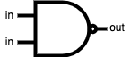
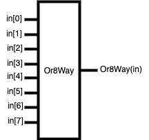
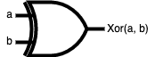
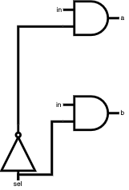

# Build a Modern Computer from First Principles: From Nand to Tetris(一)：布尔逻辑

## 本章内容：

各类基础逻辑门，基于nand门实现。

1. [与非门(Nand)](#1-nand)
2. [非门(Not), 16位非门(Not16)](#2-not-16not16)
3. [与门(And), 16位与门(And16)](#3-and-16and16)
4. [或门(Or), 16位或门(Or16), 8通道或门(Or8Way)](#4-or-16or16-8or8way)
5. [异或门(Xor)](#5-xor)
6. [复用器(Mux), 16位复用器(Mux16), 4通道16位复用器(Mux4Way16), 8通道16位复用器(Mux8Way16)](#6-mux-16mux16-416mux4way16-816mux8way16)
7. [解复用器(DMux), 4通道解复用器(DMux4Way), 8通道解复用器(DMux8Way)](#7-dmux-4dmux4way-8dmux8way)
8. [常见问题](#8)

---

### 1. 与非门(Nand)

从本项目的标题入手，我们就能知晓搭建计算机模型的起点与"原料"即是 与非门(Nand)。

Nand门存在2个输入与1个输出。

##### 逻辑符号

##### 真值表

| a | b | Nand(a,b) |
|:-:|:-:|:-:|
| 0 | 0 | 1 |
| 0 | 1 | 1 |
| 1 | 0 | 1 |
| 1 | 1 | 0 |

##### 实现方式

略。   
(值得注意的是，Nand门作为第一个介绍的逻辑门，是本项目最小粒度的元件。我们可以不用去了解该元件的内部结构。如果有对此感兴趣的同学，可以自行上网查询。)

---

### 2. 非门(Not), 16位非门(Not16)

#### 非门(Not)

Not门存在1个输入和1个输出，其功能很简单，即将输出取反并输出。

##### 逻辑符号

##### 真值表
| in | Not(in) |
|:-:|:-:|
| 0 | 1 |
| 1 | 0 |

##### 实现方式
让Nand门的两个输入均为in，则其输出即为Not(in)。

##### 代码
~~~
/**
 * Not gate:
 * out = not in
 */

CHIP Not {
    IN in;
    OUT out;

    PARTS:
    Nand (a=in, b=in, out=out);
}
~~~

#### 16位非门(Not16)
实现Not16，只要将16个Not门并排即可简单实现。

##### 逻辑符号

##### 实现方式

##### 代码
~~~
/**
 * 16-bit Not:
 * for i=0..15: out[i] = not in[i]
 */

CHIP Not16 {
    IN in[16];
    OUT out[16];

    PARTS:
    Not (in=in[0], out=out[0]);
    Not (in=in[1], out=out[1]);
    Not (in=in[2], out=out[2]);
    Not (in=in[3], out=out[3]);
    Not (in=in[4], out=out[4]);
    Not (in=in[5], out=out[5]);
    Not (in=in[6], out=out[6]);
    Not (in=in[7], out=out[7]);
    Not (in=in[8], out=out[8]);
    Not (in=in[9], out=out[9]);
    Not (in=in[10], out=out[10]);
    Not (in=in[11], out=out[11]);
    Not (in=in[12], out=out[12]);
    Not (in=in[13], out=out[13]);
    Not (in=in[14], out=out[14]);
    Not (in=in[15], out=out[15]);
}
~~~

---

### 3. 与门(And), 16位与门(And16)

#### 与门(And)
And门存在2个输入和1个输出，只有在2个输入为1的情况下，输出才为1; 其余情况均输出0.

##### 逻辑符号

##### 真值表
| a | b | And(a,b) |
|:-:|:-:|:-:|
| 0 | 0 | 0 |
| 0 | 1 | 0 |
| 1 | 0 | 0 |
| 1 | 1 | 1 |

##### 实现方式
Nand门接一个Not门，即可实现And门。

##### 代码
~~~
/**
 * And gate: 
 * out = 1 if (a == 1 and b == 1)
 *       0 otherwise
 */

CHIP And {
    IN a, b;
    OUT out;

    PARTS:
    Nand (a=a, b=b, out=notAandB);
    Not (in=notAandB, out=out);
}
~~~

#### 16位与门(And16)
实现And16，只要将16个And门并排即可简单实现。

##### 逻辑符号

##### 实现方式

##### 代码
~~~
/**
 * 16-bit bitwise And:
 * for i = 0..15: out[i] = (a[i] and b[i])
 */

CHIP And16 {
    IN a[16], b[16];
    OUT out[16];

    PARTS:
    And (a=a[0], b=b[0], out=out[0]);
    And (a=a[1], b=b[1], out=out[1]);
    And (a=a[2], b=b[2], out=out[2]);
    And (a=a[3], b=b[3], out=out[3]);
    And (a=a[4], b=b[4], out=out[4]);
    And (a=a[5], b=b[5], out=out[5]);
    And (a=a[6], b=b[6], out=out[6]);
    And (a=a[7], b=b[7], out=out[7]);
    And (a=a[8], b=b[8], out=out[8]);
    And (a=a[9], b=b[9], out=out[9]);
    And (a=a[10], b=b[10], out=out[10]);
    And (a=a[11], b=b[11], out=out[11]);
    And (a=a[12], b=b[12], out=out[12]);
    And (a=a[13], b=b[13], out=out[13]);
    And (a=a[14], b=b[14], out=out[14]);
    And (a=a[15], b=b[15], out=out[15]);
}
~~~

---

### 4. 或门(Or), 16位或门(Or16), 8通道或门(Or8Way)

#### 或门(Or)
Or门存在2个输入和1个输出，只有在2个输入为0的情况下，输出才为0; 其余情况均输出1.

##### 逻辑符号

##### 真值表
| a | b | Or(a,b) |
|:-:|:-:|:-:|
| 0 | 0 | 0 |
| 0 | 1 | 1 |
| 1 | 0 | 1 |
| 1 | 1 | 1 |

##### 实现方式
2个输入用Not门取反后，并接Nand门，即可实现Or门。

##### 代码
~~~
 /**
 * Or gate:
 * out = 1 if (a == 1 or b == 1)
 *       0 otherwise
 */

CHIP Or {
    IN a, b;
    OUT out;

    PARTS:
    Not (in=a, out=notA);
    Not (in=b, out=notB);
    Nand (a=notA, b=notB, out=out);
}
~~~

#### 16位或门(Or16)
实现Or16，只要将16个Or门并排即可简单实现。

##### 逻辑符号

##### 实现方式

##### 代码
~~~
/**
 * 16-bit bitwise Or:
 * for i = 0..15 out[i] = (a[i] or b[i])
 */

CHIP Or16 {
    IN a[16], b[16];
    OUT out[16];

    PARTS:
    Or (a=a[0], b=b[0], out=out[0]);
    Or (a=a[1], b=b[1], out=out[1]);
    Or (a=a[2], b=b[2], out=out[2]);
    Or (a=a[3], b=b[3], out=out[3]);
    Or (a=a[4], b=b[4], out=out[4]);
    Or (a=a[5], b=b[5], out=out[5]);
    Or (a=a[6], b=b[6], out=out[6]);
    Or (a=a[7], b=b[7], out=out[7]);
    Or (a=a[8], b=b[8], out=out[8]);
    Or (a=a[9], b=b[9], out=out[9]);
    Or (a=a[10], b=b[10], out=out[10]);
    Or (a=a[11], b=b[11], out=out[11]);
    Or (a=a[12], b=b[12], out=out[12]);
    Or (a=a[13], b=b[13], out=out[13]);
    Or (a=a[14], b=b[14], out=out[14]);
    Or (a=a[15], b=b[15], out=out[15]);
}
~~~

#### 8通道或门(Or8Way)
实现8Way，只要将8路输入使用Or门并联即可。

##### 逻辑符号

##### 实现方式

##### 代码
~~~
/**
 * 8-way Or: 
 * out = (in[0] or in[1] or ... or in[7])
 */

CHIP Or8Way {
    IN in[8];
    OUT out;

    PARTS:
    Or (a=in[0], b=in[1], out=Or01);
    Or (a=in[2], b=in[3], out=Or23);
    Or (a=in[4], b=in[5], out=Or45);
    Or (a=in[6], b=in[7], out=Or67);
    Or (a=Or01, b=Or23, out=Or0123);
    Or (a=Or45, b=Or67, out=Or4567);
    Or (a=Or0123, b=Or4567, out=out);
}
~~~

---

### 5. 异或门(Xor)
Xor门存在2个输入和1个输出，当2个输入相同时，输出为0; 当两个输入不同时，输出为1.

##### 逻辑符号

##### 真值表
| a | b | Xor(a,b) |
|:-:|:-:|:-:|
| 0 | 0 | 0 |
| 0 | 1 | 1 |
| 1 | 0 | 1 |
| 1 | 1 | 0 |

##### 实现方式
利用公式化简法得出Xor门的实现方法。

##### 代码
~~~
/**
 * Exclusive-or gate:
 * out = not (a == b)
 */

CHIP Xor {
    IN a, b;
    OUT out;

    PARTS:
    Not (in=a, out=notA);
    Not (in=b, out=notB);
    And (a=notA, b=b, out=notAandB);
    And (a=a, b=notB, out=AandnotB);
    Or (a=notAandB, b=AandnotB, out=out);
}
~~~

---

### 6. 复用器(Mux), 16位复用器(Mux16), 4通道16位复用器(Mux4Way16), 8通道16位复用器(Mux8Way16)

#### 复用器(Mux)
Mux存在2个输入，1个选择位和1个输出。可以根据选择位来确定将哪一个输入位的值输出。

##### 逻辑符号

##### 真值表
| a | b | sel | Mux(a,b) |
|:-:|:-:|:-:|:-:|
| 0 | 0 | 0 | 0 |
| 0 | 1 | 0 | 0 |
| 1 | 0 | 0 | 1 |
| 1 | 1 | 0 | 1 |
| 0 | 0 | 1 | 0 |
| 0 | 1 | 1 | 1 |
| 1 | 0 | 1 | 0 |
| 1 | 1 | 1 | 1 |

##### 实现方式
依旧可以利用公式化简法得出Mux的实现方法。

##### 代码
~~~
/** 
 * Multiplexor:
 * out = a if sel == 0
 *       b otherwise
 */

CHIP Mux {
    IN a, b, sel;
    OUT out;

    PARTS:
    Not (in=sel, out=notSel);
    And (a=a, b=notSel, out=AandNotSel);
    And (a=b, b=sel, out=BandSel);
    Or (a=AandNotSel, b=BandSel, out=out);
}
~~~

#### 16位复用器(Mux16)
实现Mux16，只要使用1位sel进行16位输入的选择，即可简单实现。

##### 逻辑符号

##### 实现方式

##### 代码
~~~
/**
 * 16-bit multiplexor: 
 * for i = 0..15 out[i] = a[i] if sel == 0 
 *                        b[i] if sel == 1
 */

CHIP Mux16 {
    IN a[16], b[16], sel;
    OUT out[16];

    PARTS:
    Mux (a=a[0], b=b[0], sel=sel, out=out[0]);
    Mux (a=a[1], b=b[1], sel=sel, out=out[1]);
    Mux (a=a[2], b=b[2], sel=sel, out=out[2]);
    Mux (a=a[3], b=b[3], sel=sel, out=out[3]);
    Mux (a=a[4], b=b[4], sel=sel, out=out[4]);
    Mux (a=a[5], b=b[5], sel=sel, out=out[5]);
    Mux (a=a[6], b=b[6], sel=sel, out=out[6]);
    Mux (a=a[7], b=b[7], sel=sel, out=out[7]);
    Mux (a=a[8], b=b[8], sel=sel, out=out[8]);
    Mux (a=a[9], b=b[9], sel=sel, out=out[9]);
    Mux (a=a[10], b=b[10], sel=sel, out=out[10]);
    Mux (a=a[11], b=b[11], sel=sel, out=out[11]);
    Mux (a=a[12], b=b[12], sel=sel, out=out[12]);
    Mux (a=a[13], b=b[13], sel=sel, out=out[13]);
    Mux (a=a[14], b=b[14], sel=sel, out=out[14]);
    Mux (a=a[15], b=b[15], sel=sel, out=out[15]);
}
~~~

#### 4通道16位复用器(Mux4Way16)
4路Mux16输入，需要用2位选择位进行控制。

##### 逻辑符号

##### 实现方式

##### 代码
~~~
/**
 * 4-way 16-bit multiplexor:
 * out = a if sel == 00
 *       b if sel == 01
 *       c if sel == 10
 *       d if sel == 11
 */

CHIP Mux4Way16 {
    IN a[16], b[16], c[16], d[16], sel[2];
    OUT out[16];

    PARTS:
    Mux16 (a=a[0..15], b=b[0..15], sel=sel[0], out=path0);
    Mux16 (a=c[0..15], b=d[0..15], sel=sel[0], out=path1);
    Mux16 (a=path0, b=path1, sel=sel[1], out=out[0..15]);
}
~~~

#### 8通道16位复用器(Mux8Way16)
8通道16位复用器，实际上只要使用4通道16位复用器和1个复用器即可组合而成。

##### 逻辑符号

##### 实现方式

##### 代码
~~~
/**
 * 8-way 16-bit multiplexor:
 * out = a if sel == 000
 *       b if sel == 001
 *       etc.
 *       h if sel == 111
 */

CHIP Mux8Way16 {
    IN a[16], b[16], c[16], d[16],
       e[16], f[16], g[16], h[16],
       sel[3];
    OUT out[16];

    PARTS:
    Mux4Way16 (a=a, b=b, c=c, d=d, sel=sel[0..1], out=path0);
    Mux4Way16 (a=e, b=f, c=g, d=h, sel=sel[0..1], out=path1);
    Mux16 (a=path0, b=path1, sel=sel[2], out=out);
}
~~~

---

### 7. 解复用器(DMux), 4通道解复用器(DMux4Way), 8通道解复用器(DMux8Way)

#### 解复用器(DMux)
DMux存在1个输入，1个选择位和2个输出。可以根据选择位来确定将输入位的值从哪个输出位输出。

##### 逻辑符号

##### 真值表
| sel | a | b |
|:-:|:-:|:-:|
| 0 | in | 0 |
| 1 | 0 | in |

##### 实现方式
可以利用公式化简法得出Mux的实现方法。

##### 代码
~~~
/**
 * Demultiplexor:
 * {a, b} = {in, 0} if sel == 0
 *          {0, in} if sel == 1
 */

CHIP DMux {
    IN in, sel;
    OUT a, b;

    PARTS:
    Not (in=sel, out=notSel);
    And (a=in, b=notSel, out=a);
    And (a=in, b=sel, out=b);
}
~~~

#### 4通道解复用器(DMux4Way)
4通道解复用器，实际上是使用3个解复用器形成2层的解复用。

##### 逻辑符号

##### 实现方式

##### 代码
~~~
/**
 * 4-way demultiplexor:
 * {a, b, c, d} = {in, 0, 0, 0} if sel == 00
 *                {0, in, 0, 0} if sel == 01
 *                {0, 0, in, 0} if sel == 10
 *                {0, 0, 0, in} if sel == 11
 */

CHIP DMux4Way {
    IN in, sel[2];
    OUT a, b, c, d;

    PARTS:
    DMux (in=in, sel=sel[1], a=aOut, b=bOut);
    DMux (in=aOut, sel=sel[0], a=a, b=b);
    DMux (in=bOut, sel=sel[0], a=c, b=d);
}
~~~

#### 8通道解复用器(DMux8Way)
8通道解复用器，实际上只要使用2个2通道解复用器和1个解复用器即可组合而成。

##### 逻辑符号

##### 实现方式

##### 代码
~~~
/**
 * 8-way demultiplexor:
 * {a, b, c, d, e, f, g, h} = {in, 0, 0, 0, 0, 0, 0, 0} if sel == 000
 *                            {0, in, 0, 0, 0, 0, 0, 0} if sel == 001
 *                            etc.
 *                            {0, 0, 0, 0, 0, 0, 0, in} if sel == 111
 */

CHIP DMux8Way {
    IN in, sel[3];
    OUT a, b, c, d, e, f, g, h;

    PARTS:
    DMux(in=in, sel=sel[2], a=path0,b=path1);
    DMux4Way (in=path0, sel=sel[0..1], a=a, b=b, c=c, d=d);
    DMux4Way (in=path1, sel=sel[0..1], a=e, b=f, c=g, d=h);
}
~~~

---

### 8. 常见问题

1. 本章是基于nand门实现的，为何实现过程中使用了nand门以外的逻辑门?   
   
   值得注意的是，在构建计算机系统的过程中，“整体”与“部分”的思想无处不在。使用较小的“部分”实现了较大的“整体”，该“整体”又可作为“部分”去实现更大的“整体”。因此，当我们使用nand门实现了某个逻辑门，那么我们就可以直接使用该逻辑门作为部件，去实现其他逻辑门。   
   宏观上，我们使用了nand门以外的逻辑门进行实现。但微观上，它们是一个个nand门组合起来的整体。

2. 本章提到的“公式化简法”是什么?   
   
   数字逻辑中，为了化简函数，通常使用“公式化简法” 或 “卡诺图化简法”。使用化简函数，我们可以将复杂的逻辑函数化简为有与、或、非门组成的最简逻辑函数。